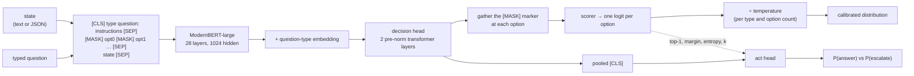

# laya

Rust inference for [Laya](https://huggingface.co/convaiinnovations/laya), a non-autoregressive
typed-decision model. You give it a **state** (text or JSON) and a set of **typed questions**;
it returns typed answers with calibrated probabilities in a single forward pass. It never
generates text, so there is nothing to parse and nothing to hallucinate.

Pure Rust on [candle](https://github.com/huggingface/candle) — no Python, no torch, no ONNX
export step. Runs on CPU, Metal, or CUDA.

## Getting the weights

The root checkpoint is Apache-2.0 and ungated, so no token is needed:

```sh
mkdir -p models/laya-base/encoder models/laya-base/tokenizer
B=https://huggingface.co/convaiinnovations/laya/resolve/main
for f in model.safetensors encoder/config.json tokenizer/tokenizer.json \
         tokenizer/tokenizer_config.json rl_agent_config.json; do
  curl -sL -o models/laya-base/$f "$B/$f"
done
```

That is ~847 MB. The repo also carries two sibling variants under `multilingual/` and
`typed-decisions/`; this crate loads any of them, since the layout is identical — point
`--model` at the directory you downloaded.

## CLI

```sh
cargo build --release
./target/release/laya \
  --state-file examples/ticket.txt \
  --questions examples/questions.json
```

```json
{
  "model": "rl-agent",
  "answers": {
    "department": {
      "type": "choice",
      "choice": "billing",
      "probabilities": { "billing": 0.9641, "technical": 0.0174, "sales": 0.0185 },
      "confidence": 0.8365,
      "rl_agent": { "act_probability": 1.0 }
    },
    "urgency": {
      "type": "score",
      "score": 0.7031,
      "legend": { "0": "not urgent", "1": "low", "2": "normal", "3": "high", "4": "critical outage" },
      "probabilities": { "0": 0.6428, "1": 0.0763, "2": 0.23, "3": 0.0366, "4": 0.0142 },
      "confidence": 0.3786,
      "rl_agent": { "act_probability": 1.0 }
    },
    "needs_human": {
      "type": "noul",
      "noul": 0.7861,
      "rl_agent": { "act_probability": 1.0 }
    }
  },
  "usage": { "input_tokens": 233, "output_tokens": 0 }
}
```

## Web console

```sh
cargo run --release --features serve --bin laya-serve   # → http://127.0.0.1:8080
```

A local single-page console: the input on the left, the decision on the right. Each answer
shows the verdict, its probability, the confidence, and one line naming the runner-up — enough
to see a close call without reading a full distribution. **Table view** opens the rest: every
option's probability, the score legend, and `P(answer)`.

Two things it shows that the CLI cannot:

- **A prompt inspector**, collapsed under the answers. The exact token sequence the encoder
  saw, coloured by segment (instructions / options / state / structure) with each scored
  `[MASK]` marker ringed and numbered, plus how much of the `max_len` budget the state used —
  and a red *state truncated* warning on the collapsed header when it overflowed.
- **Presets** for support triage, content moderation, and agent-trace review.

`⌘/Ctrl + ↵` runs. Works in light and dark, and down to phone width. It binds to loopback only
and has no auth — it is a dev tool, not a deployment.

## Library

```rust
use laya::{Agent, Options, Question};
use serde_json::json;

let agent = Agent::from_dir("models/laya-base", Options::default())?;

let questions = vec![
    ("department".to_string(),
     Question::choice("Which team owns this?", ["billing", "technical", "sales"])),
    ("urgency".to_string(),
     Question::score("How urgent?", ["not urgent", "low", "normal", "high"])),
    ("needs_human".to_string(),
     Question::noul("A human must handle this.")),
];

let response = agent.system_one(&json!("Charged twice for order #4417."), &questions)?;
println!("{}", serde_json::to_string_pretty(&response)?);
# Ok::<(), anyhow::Error>(())
```

All questions for one state go through **a single batched forward pass**, so asking five
questions costs about as much as asking one.

## The three question types

| Type | `criteria` | Answer |
|---|---|---|
| `choice` | list of labels, or `{label: description}` | the argmax label plus a distribution over labels |
| `score` | list of level descriptions | the expectation over level indices, plus the distribution |
| `noul` | optional `{"false": ..., "true": ...}` | P(the statement holds) |

`choice` criteria keep the order you wrote them in, and that order is what the label
probabilities are reported against.

Every answer also carries `rl_agent.act_probability`: the act head's probability of answering
rather than escalating to a stronger model.

## How it works



Each option gets a `[MASK]` marker in the prompt; the head scores those marker positions and
softmaxes over them. That is why the whole question set resolves in one pass and why the model
cannot emit anything outside your option list.

## Configuration

`rl_agent_config.json` sets the budgets: `max_len` 512 and `head_max_len` 192 on the root
checkpoint. Options share the head budget, so a question with many long options will fail with
an explicit `head_max_len` error rather than silently dropping options. For more than ~20
options, raise both budgets (the encoder supports up to 8192 positions) or split the question
into a coarse-to-fine pair.

## Backends

```sh
cargo build --release                       # CPU, library + laya CLI
cargo build --release --features serve      # also the laya-serve web console
cargo build --release --features metal     # Apple GPU
cargo build --release --features cuda      # NVIDIA
```

f32 only. Weights are f16 on disk and are upcast when loaded, so peak memory is around 2.4 GB;
candle's ModernBERT builds its attention mask as f32 unconditionally, so an f16 backbone fails
inside the first attention block.

## Calibration

The checkpoint ships over-confident. The bundled temperatures move mean ECE from 0.466 to
0.081 on the authors' data, but those were fitted on *their* distribution. Refit one
temperature per (question type, option count) bucket on your own data before trusting the
probabilities as probabilities; `temperature_by_options` in `rl_agent_config.json` is the knob,
keyed `choice:3-5`, `noul:2`, and so on.

Also worth knowing before you build on it: the base checkpoint is near chance on the authors'
own typed-decisions benchmark (0.362 against a 0.461 majority-class baseline). The strong
numbers belong to the fine-tuned `typed-decisions` variant. Treat this as a fast base to
specialise, not a zero-shot decision engine.

## Tests

```sh
cargo test --release
```

The rendering tests run anywhere. The inference tests skip themselves unless a checkpoint is
present at `models/laya-base` (override with `LAYA_MODEL_DIR`).

## License

Apache-2.0, matching the upstream model. The console's header image is supplied by the
repository owner and is not covered by that license.

